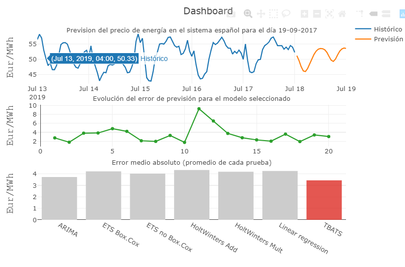

# El mercado eléctrico español

El mercado eléctrico español está compuesto por varios mercados en los que se casa la oferta a diferentes plazos. Uno de estos mercados es el mercado diario, a través del cual se fija el precio de la energía con un día de antelación. Cada día, los productores de energía presentan ofertas de venta mientras que los demandantes de energía presentan ofertas de compra.

Como resultado de las ofertas anteriores, se realiza una casación que da lugar al precio de la energía ofertada para el día siguiente.

El Operador del Mercado Ibérico Española (OMIE) gestiona de manera integrada los mercados diarios e intradiario para toda la Península Ibérica y su modelo de funcionamiento es el mismo que el de otros muchos mercados europeos. OMIE ofrece información publica sobre los precios a los que se ha cerrado la casación cada día.

# Asignaciones

La tarea consiste en:
1.	Obtener información pública sobre el resultado del cierre de la casación del mercado diario. Lo vemos en http://www.omie.es/inicio. Haremos **scraping** sobre esa página.  Ver [este fichero](https://github.com/huanlui/time-series/blob/master/development/01%20descarga_scraping/download_first.R)
2. Realizar un modelo de previsión que permitan estimar el precio de la energía del día siguiente, a partir de la información histórica. Ver [este fichero](https://github.com/huanlui/time-series/blob/master/development/02%20training_and_testing/choose_best_model.R)
3. Usar el modelo para estimar. Ver [este fichero](https://github.com/huanlui/time-series/blob/master/development/03%20forecasting/forecast_energy_spa.R)
4. Realizar una visualización de los resultados. Ver [este fichero](https://github.com/huanlui/time-series/blob/master/development/04%20visualization/plotly.R)

Este es el plot que sale: 

